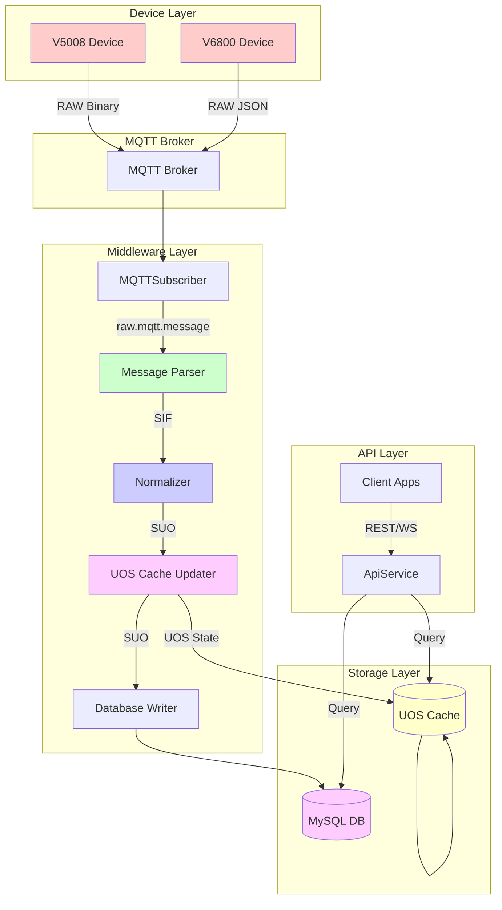

# SUO, UOS, and Database Specification

**File Name:** `SUO_UOS_DB_Spec.md`

**Version:** 1.0

**Date:** 2026-03-04

**Scope:** Specification for SIF to SUO transformation, UOS (Unified Object State) cache structure, and MySQL database schema for persisting SUO messages

**Note:** v2.0 introduces UOS (Unified Object State) design to replace the previous SUO message cache approach. See Section 5 for details.

---

## Table of Contents

1. [Overview](#1-overview)
2. [SUO Message Types](#2-suo-message-types)
3. [SIF to SUO Transformation Rules](#3-sif-to-suo-transformation-rules)
4. [SUO Message Schemas](#4-suo-message-schemas)
5. [UOS Cache Structure](#5-uos-cache-structure)
6. [Database Schema](#6-database-schema)
7. [Data Flow Diagram](#7-data-flow-diagram)

---

## 1. Overview

### 1.1 Data Layers

| Layer   | Description                                                                                      | Format    | Storage              |
| ------- | ------------------------------------------------------------------------------------------------ | --------- | -------------------- |
| **SIF** | Standard Intermediate Format - normalized device data                                            | JSON      | Transient            |
| **SUO** | Standard Unified Object - enriched with metadata, one per module                                 | JSON      | UOS Cache + DB       |
| **UOS** | Unified Object State - current state of devices and modules, aggregating data from all SUO types | In-Memory | Redis/Node.js Memory |
| **DB**  | MySQL tables for historical data storage                                                         | SQL       | MySQL                |

**Note:** UOS (Unified Object State) caches the current state of devices and modules by aggregating data from multiple SUO message types into unified state objects. Each module has ONE cache entry containing all its telemetry data with per-data-type timestamps for staleness detection.

### 1.2 Key Design Principles

1. **UOS State-Centric** - Cache unified device/module state, not individual SUO messages. Each module has ONE cache entry containing all its telemetry data.
2. **One SUO per ModuleIndex** - Each SUO message represents data for a single module, except for `SUO_DEV_MOD` and `SUO_HEARTBEAT` which can contain multiple modules
3. **Flattening Rule** - When V6800 SIF contains multiple moduleIndex entries, flatten to individual SUO messages (except `DEV_MOD_INFO` and `HEARTBEAT`)
4. **Unified Metadata** - `SUO_DEV_MOD` combines device and module metadata from both V5008 and V6800 devices
5. **Timestamp Enrichment** - All SUO messages include server-side timestamps for tracking
6. **Consistent Structure** - All SUO messages follow a common structure with device metadata and message-specific data
7. **Built-in Staleness Detection** - UOS state includes per-data-type timestamps to detect stale data

---

## 2. SUO Message Types

| SUO Type             | Description                       | Source SIF Types                                                                                                       | Device Types |
| -------------------- | --------------------------------- | ---------------------------------------------------------------------------------------------------------------------- | ------------ |
| `SUO_DEV_MOD`        | Device and module metadata        | V5008: DEVICE_INFO, MODULE_INFO, HEARTBEAT<br>V6800: DEV_MOD_INFO, MOD_CHNG_EVENT                                      | V5008, V6800 |
| `SUO_HEARTBEAT`      | Device heartbeat status           | V5008: HEARTBEAT<br>V6800: HEARTBEAT                                                                                   | V5008, V6800 |
| `SUO_RFID_SNAPSHOT`  | Current RFID tag states           | V5008: RFID_SNAPSHOT<br>V6800: RFID_SNAPSHOT                                                                           | V5008, V6800 |
| `SUO_RFID_EVENT`     | RFID attach/detach events         | V6800: RFID_EVENT                                                                                                      | V6800 only   |
| `SUO_TEMP_HUM`       | Temperature and humidity readings | V5008: TEMP_HUM<br>V6800: TEMP_HUM, QUERY_TEMP_HUM_RESP                                                                | V5008, V6800 |
| `SUO_NOISE_LEVEL`    | Noise level readings              | V5008: NOISE_LEVEL                                                                                                     | V5008 only   |
| `SUO_DOOR_STATE`     | Door open/close state             | V5008: DOOR_STATE<br>V6800: DOOR_STATE_EVENT, QUERY_DOOR_STATE_RESP                                                    | V5008, V6800 |
| `SUO_COMMAND_RESULT` | Command response results          | V5008: QUERY_COLOR_RESP, SET_COLOR_RESP, CLEAR_ALARM_RESP<br>V6800: SET_COLOR_RESP, QUERY_COLOR_RESP, CLEAR_ALARM_RESP | V5008, V6800 |

---

## 3. SIF to SUO Transformation Rules

### 3.1 Common Transformation Rules

All SUO messages include the following common fields:

```json
{
  "suoType": "string",
  "deviceId": "string",
  "deviceType": "V5008" | "V6800",
  "moduleIndex": "number",
  "moduleId": "string",
  "serverTimestamp": "ISO8601",
  "deviceTimestamp": "ISO8601 | null",
  "messageId": "string",
  "data": {}
}
```

| Field             | Description                                 | Source                                    |
| ----------------- | ------------------------------------------- | ----------------------------------------- |
| `suoType`         | Type of SUO message                         | Derived from SIF messageType              |
| `deviceId`        | Unique device identifier                    | SIF.deviceId                              |
| `deviceType`      | Device type (V5008 or V6800)                | SIF.deviceType                            |
| `moduleIndex`     | Module index (1-5 for V5008, 1-N for V6800) | SIF.moduleIndex or SIF.data[].moduleIndex |
| `moduleId`        | Module serial number                        | SIF.moduleId or SIF.data[].moduleId       |
| `serverTimestamp` | Server-side timestamp when SUO was created  | Generated by middleware                   |
| `deviceTimestamp` | Device-side timestamp (if available)        | Extracted from SIF if present             |
| `messageId`       | Original message ID from device             | SIF.messageId                             |
| `data`            | Message-specific data                       | Transformed from SIF                      |

### 3.2 Flattening Rule for V6800 Multi-Module Messages

When V6800 SIF messages contain multiple modules in the `data` array, apply the following rules:

**Apply Flattening (Create one SUO per module):**

- `RFID_SNAPSHOT`
- `RFID_EVENT`
- `TEMP_HUM`
- `QUERY_TEMP_HUM_RESP`
- `DOOR_STATE_EVENT`
- `QUERY_DOOR_STATE_RESP`

**Do NOT Apply Flattening (Keep as single SUO with multiple modules):**

- `DEV_MOD_INFO`
- `MOD_CHNG_EVENT`
- `HEARTBEAT`

**Note:** Command response messages (QUERY_COLOR_RESP, SET_COLOR_RESP, CLEAR_ALARM_RESP) are mapped to `SUO_COMMAND_RESULT` instead of flattening to `SUO_RFID_SNAPSHOT`. See Section 4.8 for details.

### 3.3 SUO_DEV_MOD Transformation

`SUO_DEV_MOD` is a special case that combines metadata from multiple SIF sources:

#### V5008 Sources → SUO_DEV_MOD

| SIF Type      | Fields Mapped                                          |
| ------------- | ------------------------------------------------------ |
| `DEVICE_INFO` | `ip`, `mask`, `gwIp`, `mac`, `model`, `fwVer` (device) |
| `MODULE_INFO` | `moduleIndex`, `moduleId`, `fwVer` (module)            |
| `HEARTBEAT`   | `moduleIndex`, `moduleId`, `uTotal`                    |

#### V6800 Sources → SUO_DEV_MOD

| SIF Type         | Fields Mapped                                             |
| ---------------- | --------------------------------------------------------- |
| `DEV_MOD_INFO`   | `ip`, `mac`, `moduleIndex`, `moduleId`, `fwVer`, `uTotal` |
| `MOD_CHNG_EVENT` | `moduleIndex`, `moduleId`, `fwVer`, `uTotal`              |

**Note:** `SUO_DEV_MOD` can contain multiple modules in the `data` array (no flattening).

---

## 4. SUO Message Schemas

### 4.1 SUO_DEV_MOD

Device and module metadata message.

```json
{
  "suoType": "SUO_DEV_MOD",
  "deviceId": "2437871205",
  "deviceType": "V5008",
  "serverTimestamp": "2026-02-25T10:30:00.000Z",
  "deviceTimestamp": null,
  "messageId": "654367990",
  "ip": "192.168.0.211",
  "mask": "255.255.0.0",
  "gwIp": "192.168.0.1",
  "mac": "80:82:91:4E:F6:65",
  "model": "2509",
  "fwVer": "2509101151",
  "modules": [
    {
      "moduleIndex": 1,
      "moduleId": "1234567890",
      "fwVer": "2509101151",
      "uTotal": 54
    },
    {
      "moduleIndex": 2,
      "moduleId": "1234567891",
      "fwVer": "2509101152",
      "uTotal": 54
    }
  ]
}
```

**Fields:**

| Field                   | Type   | Description                           |
| ----------------------- | ------ | ------------------------------------- |
| `ip`                    | string | Device IP address                     |
| `mask`                  | string | Network mask                          |
| `gwIp`                  | string | Gateway IP address                    |
| `mac`                   | string | MAC address                           |
| `model`                 | string | Device model                          |
| `fwVer`                 | string | Device firmware version               |
| `modules[]`             | array  | Array of module information           |
| `modules[].moduleIndex` | number | Module index                          |
| `modules[].moduleId`    | string | Module serial number                  |
| `modules[].fwVer`       | string | Module firmware version               |
| `modules[].uTotal`      | number | Total number of sensors (U positions) |

**Note:** This message type uses a flat structure (no `moduleIndex`/`moduleId` at root level, no nested `data` object).

### 4.2 SUO_HEARTBEAT

Device heartbeat status message.

```json
{
  "suoType": "SUO_HEARTBEAT",
  "deviceId": "2437871205",
  "deviceType": "V6800",
  "serverTimestamp": "2026-02-28T10:30:00.000Z",
  "deviceTimestamp": null,
  "messageId": "654367990",
  "meta": {
    "busVoltage": "12.5",
    "busCurrent": "2.3",
    "mainPower": 1,
    "backupPower": 0
  },
  "modules": [
    {
      "moduleIndex": 1,
      "moduleId": "1234567890",
      "uTotal": 54
    },
    {
      "moduleIndex": 2,
      "moduleId": "1234567891",
      "uTotal": 54
    }
  ]
}
```

**Fields:**

| Field                   | Type           | Description                           |
| ----------------------- | -------------- | ------------------------------------- |
| `meta.busVoltage`       | string \| null | Bus voltage (V6800 only)              |
| `meta.busCurrent`       | string \| null | Bus current (V6800 only)              |
| `meta.mainPower`        | number \| null | Main power status (V6800 only)        |
| `meta.backupPower`      | number \| null | Backup power status (V6800 only)      |
| `modules[]`             | array          | Array of module heartbeat data        |
| `modules[].moduleIndex` | number         | Module index                          |
| `modules[].moduleId`    | string         | Module serial number                  |
| `modules[].uTotal`      | number         | Total number of sensors (U positions) |

**Note:** This message type uses a flat structure (no `moduleIndex`/`moduleId` at root level, no nested `data` object).
| `meta` | object | Device-specific metadata (optional, varies by device type) |
| `meta.busVoltage` | string \| null | Bus voltage in V (V6800 only, null for V5008) |
| `meta.busCurrent` | string \| null | Bus current in A (V6800 only, null for V5008) |
| `meta.mainPower` | number \| null | Main power status 0/1 (V6800 only, null for V5008) |
| `meta.backupPower` | number \| null | Backup power status 0/1 (V6800 only, null for V5008) |
| `data.modules[]` | array | Array of module heartbeat status |
| `data.modules[].moduleIndex` | number | Module index |
| `data.modules[].moduleId` | string | Module serial number |
| `data.modules[].uTotal` | number | Total number of sensors |

### 4.3 SUO_RFID_SNAPSHOT

Current RFID tag states for a specific module.

```json
{
  "suoType": "SUO_RFID_SNAPSHOT",
  "deviceId": "2437871205",
  "deviceType": "V5008",
  "moduleIndex": 2,
  "moduleId": "1234567891",
  "serverTimestamp": "2026-02-25T10:30:00.000Z",
  "deviceTimestamp": null,
  "messageId": "654367990",
  "data": {
    "sensors": [
      {
        "sensorIndex": 1,
        "tagId": "DD344A44",
        "isAlarm": false
      },
      {
        "sensorIndex": 2,
        "tagId": "DD344A45",
        "isAlarm": true
      },
      {
        "sensorIndex": 3,
        "tagId": null,
        "isAlarm": false
      }
    ]
  }
}
```

**Fields:**

| Field                        | Type           | Description                                 |
| ---------------------------- | -------------- | ------------------------------------------- |
| `moduleIndex`                | number         | Module index (1-5 for V5008, 1-N for V6800) |
| `moduleId`                   | string         | Module serial number                        |
| `data.sensors[]`             | array          | Array of sensor RFID states                 |
| `data.sensors[].sensorIndex` | number         | Sensor index (1-54)                         |
| `data.sensors[].tagId`       | string \| null | Tag ID (hex string), null if no tag         |
| `data.sensors[].isAlarm`     | boolean        | Alarm status                                |

### 4.4 SUO_RFID_EVENT

RFID attach/detach event for a specific module (V6800 only).

```json
{
  "suoType": "SUO_RFID_EVENT",
  "deviceId": "2437871205",
  "deviceType": "V6800",
  "moduleIndex": 4,
  "moduleId": "1234567893",
  "serverTimestamp": "2026-02-25T10:30:00.000Z",
  "deviceTimestamp": null,
  "messageId": "uuid-12345",
  "data": {
    "sensorIndex": 10,
    "tagId": "DD344A44",
    "action": "ATTACHED",
    "isAlarm": false
  }
}
```

**Fields:**

| Field              | Type    | Description                            |
| ------------------ | ------- | -------------------------------------- |
| `moduleIndex`      | number  | Module index                           |
| `moduleId`         | string  | Module serial number                   |
| `data.sensorIndex` | number  | Sensor index                           |
| `data.tagId`       | string  | Tag ID (hex string)                    |
| `data.action`      | string  | Event action: "ATTACHED" or "DETACHED" |
| `data.isAlarm`     | boolean | Alarm status                           |

### 4.5 SUO_TEMP_HUM

Temperature and humidity readings for a specific module.

```json
{
  "suoType": "SUO_TEMP_HUM",
  "deviceId": "2437871205",
  "deviceType": "V5008",
  "moduleIndex": 2,
  "moduleId": "1234567891",
  "serverTimestamp": "2026-02-25T10:30:00.000Z",
  "deviceTimestamp": null,
  "messageId": "654367990",
  "data": {
    "sensors": [
      {
        "sensorIndex": 10,
        "temp": 25.5,
        "hum": 60.25
      },
      {
        "sensorIndex": 11,
        "temp": null,
        "hum": null
      },
      {
        "sensorIndex": 12,
        "temp": 26.0,
        "hum": 58.5
      }
    ]
  }
}
```

**Fields:**

| Field                        | Type           | Description                                      |
| ---------------------------- | -------------- | ------------------------------------------------ |
| `moduleIndex`                | number         | Module index                                     |
| `moduleId`                   | string         | Module serial number                             |
| `data.sensors[]`             | array          | Array of sensor readings                         |
| `data.sensors[].sensorIndex` | number         | Sensor index (10-15 for V5008, varies for V6800) |
| `data.sensors[].temp`        | number \| null | Temperature in Celsius, null if invalid          |
| `data.sensors[].hum`         | number \| null | Humidity in %, null if invalid                   |

### 4.6 SUO_NOISE_LEVEL

Noise level readings for a specific module (V5008 only).

```json
{
  "suoType": "SUO_NOISE_LEVEL",
  "deviceId": "2437871205",
  "deviceType": "V5008",
  "moduleIndex": 2,
  "moduleId": "1234567891",
  "serverTimestamp": "2026-02-25T10:30:00.000Z",
  "deviceTimestamp": null,
  "messageId": "654367990",
  "data": {
    "sensors": [
      {
        "sensorIndex": 16,
        "noise": 45.5
      },
      {
        "sensorIndex": 17,
        "noise": null
      },
      {
        "sensorIndex": 18,
        "noise": 48.25
      }
    ]
  }
}
```

**Fields:**

| Field                        | Type           | Description                        |
| ---------------------------- | -------------- | ---------------------------------- |
| `moduleIndex`                | number         | Module index (1-5)                 |
| `moduleId`                   | string         | Module serial number               |
| `data.sensors[]`             | array          | Array of sensor readings           |
| `data.sensors[].sensorIndex` | number         | Sensor index (16-18)               |
| `data.sensors[].noise`       | number \| null | Noise level in dB, null if invalid |

### 4.7 SUO_DOOR_STATE

Door open/close state for a specific module.

```json
{
  "suoType": "SUO_DOOR_STATE",
  "deviceId": "2437871205",
  "deviceType": "V5008|V6800",
  "moduleIndex": 2,
  "moduleId": "1234567891",
  "serverTimestamp": "2026-02-28T10:30:00.000Z",
  "deviceTimestamp": null,
  "messageId": "654367990",
  "door1State": 1,
  "door2State": null
}
```

**Fields:**

| Field         | Type           | Description                                                   |
| ------------- | -------------- | ------------------------------------------------------------- |
| `moduleIndex` | number         | Module index (1-5 for V5008, gateway port index for V6800)    |
| `moduleId`    | string \| null | Module serial number (null for V6800 QUERY_DOOR_STATE_RESP)   |
| `door1State`  | number         | Door 1 state (0=closed, 1=open)                               |
| `door2State`  | number \| null | Door 2 state (0=closed, 1=open, null for single door sensors) |

**V5008 SIF to SUO Transformation:**

For V5008 DOOR_STATE messages, the SIF has all door state fields at the top level (not in a data array):

| SIF Field         | SUO Field     | Notes                                         |
| ----------------- | ------------- | --------------------------------------------- |
| `sif.moduleIndex` | `moduleIndex` | Direct mapping from top-level SIF field       |
| `sif.moduleId`    | `moduleId`    | Direct mapping from top-level SIF field       |
| `sif.door1State`  | `door1State`  | Direct mapping from top-level SIF field       |
| `sif.door2State`  | `door2State`  | Always `null` for V5008 (single door sensors) |

**Note:** Unlike V6800 which uses `data[]` array, V5008 DOOR_STATE has module and door state fields directly at the SIF root level since V5008 devices only have one door per message.

---

## 4.8 SUO_COMMAND_RESULT

Command response result message for query and set operations.

```json
{
  "suoType": "SUO_COMMAND_RESULT",
  "deviceId": "2437871205",
  "deviceType": "V5008|V6800",
  "moduleIndex": 1,
  "moduleId": "1234567890",
  "serverTimestamp": "2026-02-28T10:30:00.000Z",
  "deviceTimestamp": null,
  "messageId": "654367990",
  "data": {
    "commandType": "QUERY_COLOR",
    "result": "Success",
    "originalReq": "E401",
    "colorCodes": [0, 0, 0, 13, 13, 8]
  }
}
```

**Fields:**

| Field              | Type           | Description                                                                           |
| ------------------ | -------------- | ------------------------------------------------------------------------------------- |
| `moduleIndex`      | number         | Module index                                                                          |
| `moduleId`         | string         | Module serial number                                                                  |
| `data.commandType` | string         | Type of command that was executed                                                     |
| `data.result`      | string         | Command result: "Success" or "Failure"                                                |
| `data.originalReq` | string \| null | Original request data (hex string) - V5008 only, null for V6800                       |
| `data.colorCodes`  | array          | Color codes for sensors (QUERY_COLOR_RESP only, flat array where index = sensorIndex) |
| `data.sensorIndex` | number \| null | Sensor index (V5008 CLEAR_ALARM_RESP only, null for V6800)                            |

---

## 5. UOS Cache Structure

### 5.1 Overview

The UOS (Unified Object Store) is an in-memory cache that stores the **current state** of devices and modules, aggregating data from all SUO message types into unified state objects. It provides fast access to real-time device state for API queries.

**Key Design Principle:** Cache unified state, not individual messages. Each module has ONE cache entry containing all its telemetry data.

### 5.2 Cache Key Structure

The UOS cache uses a simple composite key for storing unified state:

```
Key Format: device:{deviceId}:{type}:{identifier}
```

**Examples:**

- `device:2437871205:module:1` - Device 2437871205, Module 1 telemetry
- `device:2437871205:module:2` - Device 2437871205, Module 2 telemetry
- `device:2437871205:info` - Device 2437871205, Device metadata

**Key Format Legend:**

- `module:{moduleIndex}` - Module telemetry (all sensor data for a module)
- `info` - Device metadata (network config, firmware, module list)

### 5.3 Cache Value Structure

#### 5.3.1 Module Telemetry Cache

**Cache Key:** `device:{deviceId}:module:{moduleIndex}`

**Cache Data Structure:**

```typescript
interface ModuleTelemetry {
  // Identification
  deviceId: string;
  deviceType: 'V5008' | 'V6800';
  moduleIndex: number;
  moduleId: string;

  // Status
  isOnline: boolean;
  lastSeenHb: 'ISO8601'; // Last heartbeat timestamp
  uTotal: number | null; // Total RFID slots (from HEARTBEAT)

  // Temperature & Humidity
  tempHum: Array<{
    sensorIndex: number;
    temp: number | null;
    hum: number | null;
  }>;
  lastSeenTh: 'ISO8601'; // Last TEMP_HUM update

  // Noise Level
  noiseLevel: Array<{
    sensorIndex: number;
    noise: number | null;
  }>;
  lastSeenNs: 'ISO8601'; // Last NOISE_LEVEL update

  // RFID Snapshot
  rfidSnapshot: Array<{
    sensorIndex: number;
    tagId: string | null;
    isAlarm: boolean;
  }>;
  lastSeenRfid: 'ISO8601'; // Last RFID_SNAPSHOT update

  // Door State
  door1State: number | null; // 0=closed, 1=open
  door2State: number | null; // 0=closed, 1=open, null=single door
  lastSeenDoor: 'ISO8601'; // Last DOOR_STATE update
}
```

#### 5.3.2 Device Metadata Cache

**Cache Key:** `device:{deviceId}:info`

**Cache Data Structure:**

```typescript
interface DeviceMetadata {
  // Identification
  deviceId: string;
  deviceType: 'V5008' | 'V6800';

  // Network Configuration
  ip: string;
  mac: string;

  // V5008 Only Fields
  fwVer?: string; // Device firmware version
  mask?: string; // Network mask
  gwIp?: string; // Gateway IP

  // Timestamps
  lastSeenInfo: 'ISO8601';

  // Active Modules
  activeModules: Array<{
    moduleIndex: number;
    moduleId: string;
    fwVer?: string; // Module firmware version
    uTotal: number;
  }>;
}
```

### 5.4 Cache Operations

| Operation                          | Description                                |
| ---------------------------------- | ------------------------------------------ |
| `set(key, state)`                  | Store or update unified state              |
| `get(key)`                         | Retrieve unified state                     |
| `getModule(deviceId, moduleIndex)` | Retrieve module telemetry                  |
| `getDevice(deviceId)`              | Retrieve device metadata                   |
| `getAllModules(deviceId)`          | Retrieve all module telemetry for a device |
| `delete(key)`                      | Remove cache entry                         |
| `clear()`                          | Clear all cache entries                    |
| `expire(key, ttl)`                 | Set expiration time for entry              |

### 5.5 Cache Eviction Policy

- **TTL-based**: Entries expire after a configurable time-to-live (default: 5 minutes)
- **LRU-based**: When cache is full, least recently used entries are evicted
- **Manual**: Device offline events trigger cache cleanup

### 5.7 Advantages of UOS Design

The unified state design provides several key advantages over caching individual SUO messages:

**1. No Collision Issues**
Each module has exactly ONE cache entry containing all its telemetry. No ambiguity about which SUO type is stored.

**2. Single Source of Truth**
All module data in one place. No need to query multiple keys to get complete module state.

**3. Efficient Queries**
Get complete module state with ONE cache lookup:

```javascript
const moduleState = await cache.get(`device:${deviceId}:module:${moduleIndex}`);
// Returns: tempHum, noiseLevel, rfidSnapshot, doorState, status
```

**4. Built-in Staleness Detection**
Each data type has its own `lastSeen` timestamp:

```javascript
// Check if RFID data is fresh
const age = Date.now() - new Date(moduleState.lastSeenRfid).getTime();
if (age > 60000) {
  // RFID data is stale (> 1 minute)
}
```

**5. Natural Device Model**
Matches how devices actually work:

- One module with multiple sensor types
- Each sensor type updates independently
- State is aggregation of all sensors

**6. Simpler Key Structure**
Only 2 key patterns:

- `device:{deviceId}:module:{moduleIndex}` - Module telemetry
- `device:{deviceId}:info` - Device metadata

**7. Clear Separation of Concerns**

- **Module telemetry**: Sensor readings, door state, status
- **Device metadata**: Network config, firmware, module list

### 5.8 SUO to UOS Transformation Rules

The UOS cache updater transforms individual SUO messages into unified state objects. Each SUO message updates only the relevant parts of the UOS state.

#### 5.8.1 Transformation Logic

```typescript
class UOSCacheUpdater {
  async updateModuleTelemetry(suoMessage: SUOMessage): Promise<void> {
    const key = `device:${suoMessage.deviceId}:module:${suoMessage.moduleIndex}`;

    // Get current state
    const current = (await this.cache.get(key)) || this.createEmptyModuleState(suoMessage);

    // Merge based on SUO type
    switch (suoMessage.suoType) {
      case 'SUO_HEARTBEAT':
        current.isOnline = true;
        current.lastSeenHb = new Date().toISOString();
        current.uTotal = suoMessage.data.modules[0].uTotal;
        break;

      case 'SUO_TEMP_HUM':
        current.tempHum = suoMessage.data.sensors;
        current.lastSeenTh = new Date().toISOString();
        break;

      case 'SUO_RFID_SNAPSHOT':
        current.rfidSnapshot = suoMessage.data.sensors;
        current.lastSeenRfid = new Date().toISOString();
        break;

      case 'SUO_NOISE_LEVEL':
        current.noiseLevel = suoMessage.data.sensors;
        current.lastSeenNs = new Date().toISOString();
        break;

      case 'SUO_DOOR_STATE':
        current.door1State = suoMessage.door1State;
        current.door2State = suoMessage.door2State;
        current.lastSeenDoor = new Date().toISOString();
        break;
    }

    // Update identification fields
    current.deviceId = suoMessage.deviceId;
    current.deviceType = suoMessage.deviceType;
    current.moduleIndex = suoMessage.moduleIndex;
    current.moduleId = suoMessage.moduleId;

    // Write back
    await this.cache.set(key, current);
  }

  async updateDeviceMetadata(suoMessage: SUO_DEV_MOD): Promise<void> {
    const key = `device:${suoMessage.deviceId}:info`;

    // Get current state
    const current = (await this.cache.get(key)) || this.createEmptyDeviceMetadata(suoMessage);

    // Merge device metadata
    current.ip = suoMessage.data.ip || current.ip;
    current.mac = suoMessage.data.mac || current.mac;
    current.fwVer = suoMessage.data.fwVer || current.fwVer;
    current.mask = suoMessage.data.mask || current.mask;
    current.gwIp = suoMessage.data.gwIp || current.gwIp;
    current.activeModules = suoMessage.data.modules || current.activeModules;
    current.lastSeenInfo = new Date().toISOString();

    // Write back
    await this.cache.set(key, current);
  }

  private createEmptyModuleState(suo: SUOMessage): ModuleTelemetry {
    return {
      deviceId: suo.deviceId,
      deviceType: suo.deviceType,
      moduleIndex: suo.moduleIndex,
      moduleId: suo.moduleId,
      isOnline: false,
      lastSeenHb: null,
      uTotal: null,
      tempHum: [],
      lastSeenTh: null,
      noiseLevel: [],
      lastSeenNs: null,
      rfidSnapshot: [],
      lastSeenRfid: null,
      door1State: null,
      door2State: null,
      lastSeenDoor: null,
    };
  }

  private createEmptyDeviceMetadata(suo: SUO_DEV_MOD): DeviceMetadata {
    return {
      deviceId: suo.deviceId,
      deviceType: suo.deviceType,
      ip: null,
      mac: null,
      fwVer: null,
      mask: null,
      gwIp: null,
      lastSeenInfo: null,
      activeModules: [],
    };
  }
}
```

#### 5.8.2 Redis Implementation

Using Redis Hash for efficient partial updates:

```javascript
// Update temperature data only
await redis.hset(`device:${deviceId}:module:${moduleIndex}`, {
  tempHum: JSON.stringify(newTempHumData),
  lastSeenTh: new Date().toISOString(),
});

// Get all module data
const moduleData = await redis.hgetall(`device:${deviceId}:module:${moduleIndex}`);
```

### 5.9 Data Flow Example

**Scenario: Module 1 sends multiple messages**

**Time 00:00 - HEARTBEAT**

```
UOS Cache: device:2437871205:module:1
{
  deviceId: "2437871205",
  deviceType: "V5008",
  moduleIndex: 1,
  moduleId: "1234567890",
  isOnline: true,
  lastSeenHb: "2026-03-01T00:00:00.000Z",
  uTotal: 54,
  tempHum: [],
  lastSeenTh: null,
  noiseLevel: [],
  lastSeenNs: null,
  rfidSnapshot: [],
  lastSeenRfid: null,
  door1State: null,
  door2State: null,
  lastSeenDoor: null
}
```

**Time 00:01 - TEMP_HUM**

```
UOS Cache: device:2437871205:module:1
{
  ... (previous data) ...
  tempHum: [
    { sensorIndex: 10, temp: 25.50, hum: 60.25 },
    { sensorIndex: 11, temp: 26.00, hum: 58.50 }
  ],
  lastSeenTh: "2026-03-01T00:01:00.000Z"
}
```

**Time 00:02 - RFID_SNAPSHOT**

```
UOS Cache: device:2437871205:module:1
{
  ... (previous data) ...
  rfidSnapshot: [
    { sensorIndex: 1, tagId: "DD344A44", isAlarm: false },
    { sensorIndex: 2, tagId: "DD344A45", isAlarm: true }
  ],
  lastSeenRfid: "2026-03-01T00:02:00.000Z"
}
```

**Time 00:05 - DOOR_STATE**

```
UOS Cache: device:2437871205:module:1
{
  ... (previous data) ...
  door1State: 1,
  door2State: null,
  lastSeenDoor: "2026-03-01T00:05:00.000Z"
}
```

**Result:** All module data in ONE cache entry, with timestamps for each data type.

---

## 6. Database Schema

### 6.1 Overview

The MySQL database stores historical SUO messages for querying and analytics. Each SUO type has its own table optimized for that type of data.

### 6.2 Common Table Columns

All SUO tables include the following common columns:

| Column             | Type                                              | Description                                                                                              |
| ------------------ | ------------------------------------------------- | -------------------------------------------------------------------------------------------------------- |
| `id`               | BIGINT UNSIGNED AUTO_INCREMENT PRIMARY KEY        | Unique record ID                                                                                         |
| `device_id`        | VARCHAR(64) NOT NULL                              | Device identifier                                                                                        |
| `device_type`      | ENUM('V5008', 'V6800') NOT NULL                   | Device type                                                                                              |
| `module_index`     | INT NULL                                          | Module index (null for device-level)                                                                     |
| `module_id`        | VARCHAR(64) NULL                                  | Module serial number                                                                                     |
| `server_timestamp` | DATETIME(3) NOT NULL                              | Server timestamp (milliseconds)                                                                          |
| `device_timestamp` | DATETIME(3) NULL                                  | Device timestamp (if available)                                                                          |
| `message_id`       | VARCHAR(64) NULL                                  | Original message ID (always STRING type - V5008: 4-byte integer converted to string, V6800: UUID string) |
| `created_at`       | DATETIME(3) NOT NULL DEFAULT CURRENT_TIMESTAMP(3) | Record creation time                                                                                     |

### 6.3 Indexes

All tables include the following indexes:

```sql
-- Primary key
PRIMARY KEY (id)

-- Device and module lookup
INDEX idx_device_module (device_id, module_index, server_timestamp DESC)

-- Time-based queries
INDEX idx_server_timestamp (server_timestamp DESC)

-- Device type queries
INDEX idx_device_type (device_type)

-- Message ID lookup
INDEX idx_message_id (message_id)
```

### 6.4 Table Schemas

#### 6.4.1 Table: `suo_dev_mod`

Stores device and module metadata.

```sql
CREATE TABLE suo_dev_mod (
  id BIGINT UNSIGNED AUTO_INCREMENT PRIMARY KEY,
  device_id VARCHAR(64) NOT NULL,
  device_type ENUM('V5008', 'V6800') NOT NULL,
  module_index INT NULL,
  module_id VARCHAR(64) NULL,
  server_timestamp DATETIME(3) NOT NULL,
  device_timestamp DATETIME(3) NULL,
  message_id VARCHAR(64) NULL,
  created_at DATETIME(3) NOT NULL DEFAULT CURRENT_TIMESTAMP(3),

  -- Device metadata
  ip VARCHAR(45) NULL,
  mask VARCHAR(45) NULL,
  gw_ip VARCHAR(45) NULL,
  mac VARCHAR(17) NULL,
  model VARCHAR(64) NULL,
  fw_ver VARCHAR(64) NULL,

  -- Module metadata (JSON array for multiple modules)
  modules JSON NULL,

  INDEX idx_device_module (device_id, server_timestamp DESC),
  INDEX idx_server_timestamp (server_timestamp DESC),
  INDEX idx_device_type (device_type)
) ENGINE=InnoDB DEFAULT CHARSET=utf8mb4;
```

**`modules` JSON Structure:**

```json
[
  {
    "moduleIndex": 1,
    "moduleId": "1234567890",
    "fwVer": "2509101151",
    "uTotal": 54
  }
]
```

#### 6.4.2 Table: `suo_heartbeat`

Stores device heartbeat messages.

```sql
CREATE TABLE suo_heartbeat (
  id BIGINT UNSIGNED AUTO_INCREMENT PRIMARY KEY,
  device_id VARCHAR(64) NOT NULL,
  device_type ENUM('V5008', 'V6800') NOT NULL,
  module_index INT NULL,
  module_id VARCHAR(64) NULL,
  server_timestamp DATETIME(3) NOT NULL,
  device_timestamp DATETIME(3) NULL,
  message_id VARCHAR(64) NULL,
  created_at DATETIME(3) NOT NULL DEFAULT CURRENT_TIMESTAMP(3),

  -- Power status (V6800 only, stored in meta)
  bus_voltage VARCHAR(10) NULL,
  bus_current VARCHAR(10) NULL,
  main_power TINYINT NULL,
  backup_power TINYINT NULL,

  -- Module heartbeat data (JSON array)
  modules JSON NULL,

  INDEX idx_device_module (device_id, server_timestamp DESC),
  INDEX idx_server_timestamp (server_timestamp DESC),
  INDEX idx_device_type (device_type)
) ENGINE=InnoDB DEFAULT CHARSET=utf8mb4;
```

**`modules` JSON Structure:**

```json
[
  {
    "moduleIndex": 1,
    "moduleId": "1234567890",
    "uTotal": 54
  }
]
```

#### 6.4.3 Table: `suo_rfid_snapshot`

Stores RFID snapshot messages.

```sql
CREATE TABLE suo_rfid_snapshot (
  id BIGINT UNSIGNED AUTO_INCREMENT PRIMARY KEY,
  device_id VARCHAR(64) NOT NULL,
  device_type ENUM('V5008', 'V6800') NOT NULL,
  module_index INT NOT NULL,
  module_id VARCHAR(64) NOT NULL,
  server_timestamp DATETIME(3) NOT NULL,
  device_timestamp DATETIME(3) NULL,
  message_id VARCHAR(64) NULL,
  created_at DATETIME(3) NOT NULL DEFAULT CURRENT_TIMESTAMP(3),

  -- Sensor RFID data (JSON array)
  sensors JSON NOT NULL,

  INDEX idx_device_module (device_id, module_index, server_timestamp DESC),
  INDEX idx_server_timestamp (server_timestamp DESC),
  INDEX idx_device_type (device_type),
  INDEX idx_tag_id ((CAST(sensors->'$[*].tagId' AS CHAR(32)))),
  INDEX idx_sensor_index ((CAST(sensors->'$[*].sensorIndex' AS UNSIGNED))))
) ENGINE=InnoDB DEFAULT CHARSET=utf8mb4;
```

**`sensors` JSON Structure:**

```json
[
  {
    "sensorIndex": 1,
    "tagId": "DD344A44",
    "isAlarm": false
  }
]
```

#### 6.4.4 Table: `suo_rfid_event`

Stores RFID attach/detach events (V6800 only).

```sql
CREATE TABLE suo_rfid_event (
  id BIGINT UNSIGNED AUTO_INCREMENT PRIMARY KEY,
  device_id VARCHAR(64) NOT NULL,
  device_type ENUM('V6800') NOT NULL,
  module_index INT NOT NULL,
  module_id VARCHAR(64) NOT NULL,
  server_timestamp DATETIME(3) NOT NULL,
  device_timestamp DATETIME(3) NULL,
  message_id VARCHAR(64) NULL,
  created_at DATETIME(3) NOT NULL DEFAULT CURRENT_TIMESTAMP(3),

  -- Event data
  sensor_index INT NOT NULL,
  tag_id VARCHAR(16) NOT NULL,
  action ENUM('ATTACHED', 'DETACHED') NOT NULL,
  is_alarm BOOLEAN NOT NULL,

  INDEX idx_device_module (device_id, module_index, server_timestamp DESC),
  INDEX idx_server_timestamp (server_timestamp DESC),
  INDEX idx_tag_id (tag_id),
  INDEX idx_action (action),
  INDEX idx_device_type (device_type)
) ENGINE=InnoDB DEFAULT CHARSET=utf8mb4;
```

#### 6.4.5 Table: `suo_temp_hum`

Stores temperature and humidity readings.

```sql
CREATE TABLE suo_temp_hum (
  id BIGINT UNSIGNED AUTO_INCREMENT PRIMARY KEY,
  device_id VARCHAR(64) NOT NULL,
  device_type ENUM('V5008', 'V6800') NOT NULL,
  module_index INT NOT NULL,
  module_id VARCHAR(64) NOT NULL,
  server_timestamp DATETIME(3) NOT NULL,
  device_timestamp DATETIME(3) NULL,
  message_id VARCHAR(64) NULL,
  created_at DATETIME(3) NOT NULL DEFAULT CURRENT_TIMESTAMP(3),

  -- Sensor temperature/humidity data (JSON array)
  sensors JSON NOT NULL,

  INDEX idx_device_module (device_id, module_index, server_timestamp DESC),
  INDEX idx_server_timestamp (server_timestamp DESC),
  INDEX idx_device_type (device_type),
  INDEX idx_sensor_index ((CAST(sensors->'$[*].sensorIndex' AS UNSIGNED))))
) ENGINE=InnoDB DEFAULT CHARSET=utf8mb4;
```

**`sensors` JSON Structure:**

```json
[
  {
    "sensorIndex": 10,
    "temp": 25.5,
    "hum": 60.25
  }
]
```

#### 6.4.6 Table: `suo_noise_level`

Stores noise level readings (V5008 only).

```sql
CREATE TABLE suo_noise_level (
  id BIGINT UNSIGNED AUTO_INCREMENT PRIMARY KEY,
  device_id VARCHAR(64) NOT NULL,
  device_type ENUM('V5008') NOT NULL,
  module_index INT NOT NULL,
  module_id VARCHAR(64) NOT NULL,
  server_timestamp DATETIME(3) NOT NULL,
  device_timestamp DATETIME(3) NULL,
  message_id VARCHAR(64) NULL,
  created_at DATETIME(3) NOT NULL DEFAULT CURRENT_TIMESTAMP(3),

  -- Sensor noise data (JSON array)
  sensors JSON NOT NULL,

  INDEX idx_device_module (device_id, module_index, server_timestamp DESC),
  INDEX idx_server_timestamp (server_timestamp DESC),
  INDEX idx_device_type (device_type),
  INDEX idx_sensor_index ((CAST(sensors->'$[*].sensorIndex' AS UNSIGNED))))
) ENGINE=InnoDB DEFAULT CHARSET=utf8mb4;
```

**`sensors` JSON Structure:**

```json
[
  {
    "sensorIndex": 16,
    "noise": 45.5
  }
]
```

#### 6.4.7 Table: `suo_door_state`

Stores door state messages.

```sql
CREATE TABLE suo_door_state (
  id BIGINT UNSIGNED AUTO_INCREMENT PRIMARY KEY,
  device_id VARCHAR(64) NOT NULL,
  device_type ENUM('V5008', 'V6800') NOT NULL,
  module_index INT NOT NULL,
  module_id VARCHAR(64) NULL,
  server_timestamp DATETIME(3) NOT NULL,
  device_timestamp DATETIME(3) NULL,
  message_id VARCHAR(64) NULL,
  created_at DATETIME(3) NOT NULL DEFAULT CURRENT_TIMESTAMP(3),

  -- Door state data
  door1_state TINYINT NULL,
  door2_state TINYINT NULL,

  INDEX idx_device_module (device_id, module_index, server_timestamp DESC),
  INDEX idx_server_timestamp (server_timestamp DESC),
  INDEX idx_device_type (device_type)
) ENGINE=InnoDB DEFAULT CHARSET=utf8mb4;
```

#### 6.4.8 Table: `suo_command_result`

Stores command response results.

```sql
CREATE TABLE suo_command_result (
  id BIGINT UNSIGNED AUTO_INCREMENT PRIMARY KEY,
  device_id VARCHAR(64) NOT NULL,
  device_type ENUM('V5008', 'V6800') NOT NULL,
  module_index INT NOT NULL,
  module_id VARCHAR(64) NOT NULL,
  server_timestamp DATETIME(3) NOT NULL,
  device_timestamp DATETIME(3) NULL,
  message_id VARCHAR(64) NULL,
  created_at DATETIME(3) NOT NULL DEFAULT CURRENT_TIMESTAMP(3),

  -- Command result data
  command_type VARCHAR(64) NOT NULL,
  result VARCHAR(32) NOT NULL,
  original_req VARCHAR(256) NULL,
  color_codes JSON NULL,
  sensor_index INT NULL,

  INDEX idx_device_module (device_id, module_index, server_timestamp DESC),
  INDEX idx_server_timestamp (server_timestamp DESC),
  INDEX idx_command_type (command_type),
  INDEX idx_result (result),
  INDEX idx_device_type (device_type)
) ENGINE=InnoDB DEFAULT CHARSET=utf8mb4;
```

**`color_codes` JSON Structure:**

```json
[0, 0, 0, 13, 13, 8]
```

**Note:** `color_codes` is stored as a flat array of integers where the array index corresponds to the sensor index.</think><arg_key>expected_replacements</arg_key><arg_value>1

### 6.5 Data Retention Policy

| Table                | Retention Period | Purge Strategy                 |
| -------------------- | ---------------- | ------------------------------ |
| `suo_dev_mod`        | 365 days         | Keep latest record per device  |
| `suo_heartbeat`      | 30 days          | Keep latest record per device  |
| `suo_command_result` | 30 days          | Keep latest record per command |
| `suo_rfid_snapshot`  | 90 days          | Time-based partitioning        |
| `suo_rfid_event`     | 365 days         | Archive after 90 days          |
| `suo_temp_hum`       | 90 days          | Time-based partitioning        |
| `suo_noise_level`    | 90 days          | Time-based partitioning        |
| `suo_door_state`     | 90 days          | Time-based partitioning        |

### 6.6 Partitioning Strategy

For high-volume tables, implement time-based partitioning:

```sql
-- Example: Partition suo_temp_hum by month
ALTER TABLE suo_temp_hum
PARTITION BY RANGE (TO_DAYS(server_timestamp)) (
  PARTITION p202601 VALUES LESS THAN (TO_DAYS('2026-02-01')),
  PARTITION p202602 VALUES LESS THAN (TO_DAYS('2026-03-01')),
  PARTITION p202603 VALUES LESS THAN (TO_DAYS('2026-04-01')),
  PARTITION pmax VALUES LESS THAN MAXVALUE
);
```

**Note:** JSON indexes require MySQL 5.7.8+ or MariaDB 10.2.3+. For older versions, use generated columns with regular indexes.

---

## 7. Data Flow Diagram



**Note:** UOS Cache Updater transforms individual SUO messages into unified state objects in the UOS cache.

---

## 8. SIF to SUO Transformation Examples

### 8.1 V5008 DEVICE_INFO → SUO_DEV_MOD

**SIF Input:**

```json
{
  "meta": { "topic": "V5008Upload/2437871205/OpeAck", "rawHex": "EF01..." },
  "deviceType": "V5008",
  "deviceId": "2437871205",
  "messageType": "DEVICE_INFO",
  "messageId": "654367990",
  "fwVer": "2509101151",
  "ip": "192.168.0.211",
  "mask": "255.255.0.0",
  "gwIp": "192.168.0.1",
  "mac": "80:82:91:4E:F6:65"
}
```

**SUO Output:**

```json
{
  "suoType": "SUO_DEV_MOD",
  "deviceId": "2437871205",
  "deviceType": "V5008",
  "serverTimestamp": "2026-02-25T10:30:00.000Z",
  "deviceTimestamp": null,
  "messageId": "654367990",
  "ip": "192.168.0.211",
  "mask": "255.255.0.0",
  "gwIp": "192.168.0.1",
  "mac": "80:82:91:4E:F6:65",
  "model": null,
  "fwVer": "2509101151",
  "modules": []
}
```

### 8.2 V6800 DEV_MOD_INFO → SUO_DEV_MOD

**SIF Input:**

```json
{
  "meta": { "topic": "V6800Upload/2437871205/Init", "rawType": "devies_init_req" },
  "deviceId": "2437871205",
  "deviceType": "V6800",
  "messageType": "DEV_MOD_INFO",
  "messageId": "uuid-12345",
  "ip": "192.168.0.211",
  "mac": "80:82:91:4E:F6:65",
  "data": [
    { "moduleIndex": 1, "moduleId": "1234567890", "fwVer": "1.0.0", "uTotal": 54 },
    { "moduleIndex": 2, "moduleId": "1234567891", "fwVer": "1.0.0", "uTotal": 54 }
  ]
}
```

**SUO Output:**

```json
{
  "suoType": "SUO_DEV_MOD",
  "deviceId": "2437871205",
  "deviceType": "V6800",
  "serverTimestamp": "2026-02-25T10:30:00.000Z",
  "deviceTimestamp": null,
  "messageId": "uuid-12345",
  "ip": "192.168.0.211",
  "mask": null,
  "gwIp": null,
  "mac": "80:82:91:4E:F6:65",
  "model": null,
  "fwVer": null,
  "modules": [
    { "moduleIndex": 1, "moduleId": "1234567890", "fwVer": "1.0.0", "uTotal": 54 },
    { "moduleIndex": 2, "moduleId": "1234567891", "fwVer": "1.0.0", "uTotal": 54 }
  ]
}
```

### 8.3 V6800 RFID_SNAPSHOT (Multi-Module) → Multiple SUO_RFID_SNAPSHOT

**SIF Input:**

```json
{
  "meta": { "topic": "V6800Upload/2437871205/LabelState", "rawType": "u_state_resp" },
  "deviceId": "2437871205",
  "deviceType": "V6800",
  "messageType": "RFID_SNAPSHOT",
  "messageId": "uuid-12345",
  "data": [
    {
      "moduleIndex": 1,
      "moduleId": "1234567890",
      "data": [
        { "sensorIndex": 1, "tagId": "DD344A44", "isAlarm": false },
        { "sensorIndex": 2, "tagId": "DD344A45", "isAlarm": true }
      ]
    },
    {
      "moduleIndex": 2,
      "moduleId": "1234567891",
      "data": [{ "sensorIndex": 1, "tagId": "DD344A46", "isAlarm": false }]
    }
  ]
}
```

**SUO Output (2 messages):**

**Message 1:**

```json
{
  "suoType": "SUO_RFID_SNAPSHOT",
  "deviceId": "2437871205",
  "deviceType": "V6800",
  "moduleIndex": 1,
  "moduleId": "1234567890",
  "serverTimestamp": "2026-02-25T10:30:00.000Z",
  "deviceTimestamp": null,
  "messageId": "uuid-12345",
  "data": {
    "sensors": [
      { "sensorIndex": 1, "tagId": "DD344A44", "isAlarm": false },
      { "sensorIndex": 2, "tagId": "DD344A45", "isAlarm": true }
    ]
  }
}
```

**Message 2:**

```json
{
  "suoType": "SUO_RFID_SNAPSHOT",
  "deviceId": "2437871205",
  "deviceType": "V6800",
  "moduleIndex": 2,
  "moduleId": "1234567891",
  "serverTimestamp": "2026-02-25T10:30:00.000Z",
  "deviceTimestamp": null,
  "messageId": "uuid-12345",
  "data": {
    "sensors": [{ "sensorIndex": 1, "tagId": "DD344A46", "isAlarm": false }]
  }
}
```

---

## Appendix A: SUO Message Type Mapping

| SIF Message Type             | SUO Type                   | Flattening Required |
| ---------------------------- | -------------------------- | ------------------- |
| V5008: DEVICE_INFO           | SUO_DEV_MOD                | No                  |
| V5008: MODULE_INFO           | SUO_DEV_MOD                | No (merged)         |
| V5008: HEARTBEAT             | SUO_HEARTBEAT, SUO_DEV_MOD | No                  |
| V5008: RFID_SNAPSHOT         | SUO_RFID_SNAPSHOT          | No (single module)  |
| V5008: TEMP_HUM              | SUO_TEMP_HUM               | No (single module)  |
| V5008: NOISE_LEVEL           | SUO_NOISE_LEVEL            | No (single module)  |
| V5008: DOOR_STATE            | SUO_DOOR_STATE             | No (single module)  |
| V5008: QUERY_COLOR_RESP      | SUO_COMMAND_RESULT         | No                  |
| V5008: SET_COLOR_RESP        | SUO_COMMAND_RESULT         | No                  |
| V5008: CLEAR_ALARM_RESP      | SUO_COMMAND_RESULT         | No                  |
| V6800: DEV_MOD_INFO          | SUO_DEV_MOD                | No                  |
| V6800: MOD_CHNG_EVENT        | SUO_DEV_MOD                | No                  |
| V6800: HEARTBEAT             | SUO_HEARTBEAT              | No                  |
| V6800: RFID_EVENT            | SUO_RFID_EVENT             | Yes                 |
| V6800: RFID_SNAPSHOT         | SUO_RFID_SNAPSHOT          | Yes                 |
| V6800: TEMP_HUM              | SUO_TEMP_HUM               | Yes                 |
| V6800: QUERY_TEMP_HUM_RESP   | SUO_TEMP_HUM               | Yes                 |
| V6800: DOOR_STATE_EVENT      | SUO_DOOR_STATE             | Yes                 |
| V6800: QUERY_DOOR_STATE_RESP | SUO_DOOR_STATE             | Yes                 |
| V6800: SET_COLOR_RESP        | SUO_COMMAND_RESULT         | No                  |
| V6800: QUERY_COLOR_RESP      | SUO_COMMAND_RESULT         | No                  |
| V6800: CLEAR_ALARM_RESP      | SUO_COMMAND_RESULT         | No                  |

---

## Appendix B: Database Query Examples

### B.1 Query Latest RFID Snapshot for a Device and Module

```sql
SELECT *
FROM suo_rfid_snapshot
WHERE device_id = '2437871205'
  AND module_index = 2
ORDER BY server_timestamp DESC
LIMIT 1;
```

### B.2 Query Temperature History for a Time Range

```sql
SELECT server_timestamp, sensors
FROM suo_temp_hum
WHERE device_id = '2437871205'
  AND module_index = 2
  AND server_timestamp BETWEEN '2026-02-25 00:00:00' AND '2026-02-25 23:59:59'
ORDER BY server_timestamp ASC;
```

### B.3 Query Tag Events for a Specific Tag

```sql
SELECT server_timestamp, device_id, module_index, sensor_index, action, is_alarm
FROM suo_rfid_event
WHERE tag_id = 'DD344A44'
ORDER BY server_timestamp DESC
LIMIT 100;
```

### B.4 Query Command Results

```sql
SELECT *
FROM suo_command_result
WHERE device_id = '2437871205'
  AND module_index = 1
ORDER BY server_timestamp DESC
LIMIT 10;
```

### B.5 Query Device Metadata

```sql
SELECT *
FROM suo_dev_mod
WHERE device_id = '2437871205'
ORDER BY server_timestamp DESC
LIMIT 1;
```
