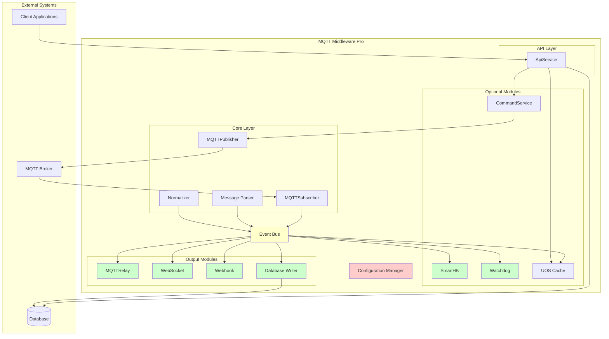
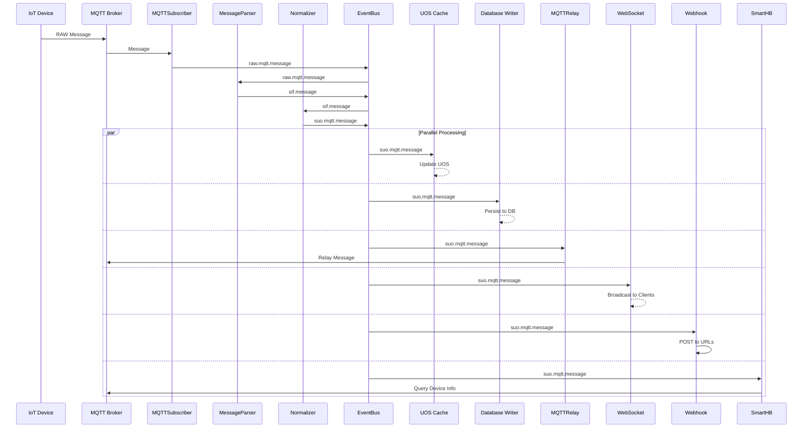
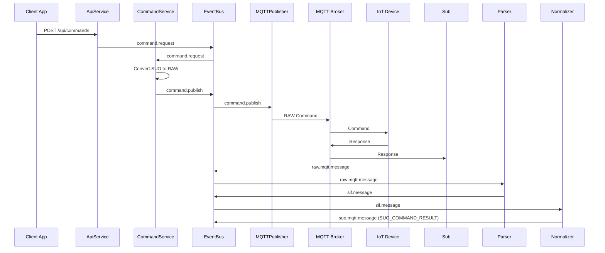
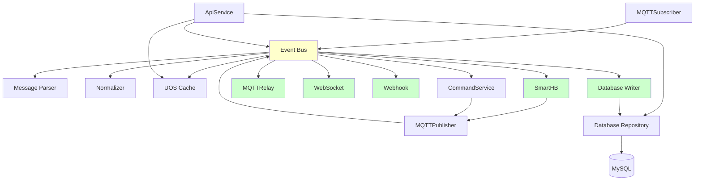

# MQTT Middleware Pro - Architecture Document

**Version:** 1.0  
**Date:** 2026-03-04  
**Status:** Final

---

## Table of Contents

1. [Overview](#1-overview)
2. [Architectural Principles](#2-architectural-principles)
3. [System Architecture](#3-system-architecture)
4. [Module Design](#4-module-design)
5. [Database Layer](#5-database-layer)
6. [Configuration System](#6-configuration-system)
7. [Folder Structure](#7-folder-structure)
8. [Data Flow](#8-data-flow)
9. [State Model](#9-state-model)
10. [Interfaces](#10-interfaces)
11. [Deployment Considerations](#11-deployment-considerations)

---

## 1. Overview

MQTT Middleware Pro is a modular, high-throughput integration layer designed for flexibility and maintainability. The architecture supports:

- **Independent MQTT Broker**: Configurable broker connection (ActiveMQ for testing)
- **Modular Components**: All major modules can be independently enabled/disabled
- **Event-Driven Architecture**: Loose coupling between components via event bus
- **Scalable Design**: Horizontal scaling support
- **Simple Database Layer**: Direct MySQL 8.0 implementation

---

## 2. Architectural Principles

### 2.1 Core Principles

| Principle                  | Description                                                                       |
| -------------------------- | --------------------------------------------------------------------------------- |
| **Separation of Concerns** | Each module has a single, well-defined responsibility                             |
| **Dependency Inversion**   | High-level modules don't depend on low-level modules; both depend on abstractions |
| **Open/Closed Principle**  | Modules are open for extension but closed for modification                        |
| **Interface Segregation**  | Clients depend only on interfaces they use                                        |
| **Configuration-Driven**   | Behavior controlled through configuration, not code changes                       |

### 2.2 Design Patterns

| Pattern                       | Usage                                               |
| ----------------------------- | --------------------------------------------------- |
| **Event-Driven Architecture** | Loose coupling via event bus                        |
| **Plugin/Module Pattern**     | Configurable enable/disable of components           |
| **Factory Pattern**           | Dynamic module instantiation based on configuration |
| **Observer Pattern**          | Event emission and subscription                     |

---

## 3. System Architecture

### 3.1 High-Level Architecture



### 3.2 Component Configurability

All modules support enable/disable through configuration:

| Module          | Config Key                        | Default | Description                      |
| --------------- | --------------------------------- | ------- | -------------------------------- |
| SmartHB         | `modules.smartHB.enabled`         | `true`  | Smart Heartbeat processing       |
| ProtocolAdapter | `modules.protocolAdapter.enabled` | `true`  | Protocol alignment (V5008/V6800) |
| Watchdog        | `modules.watchdog.enabled`        | `true`  | Scheduled task execution         |
| MQTTRelay       | `modules.mqttRelay.enabled`       | `true`  | MQTT message relaying            |
| WebSocket       | `modules.websocket.enabled`       | `true`  | WebSocket broadcasting           |
| Webhook         | `modules.webhook.enabled`         | `true`  | HTTP webhook delivery            |
| Database        | `modules.database.enabled`        | `true`  | Database persistence             |

### 3.3 MQTT Broker Independence

The MQTT broker connection is fully configurable:

```typescript
interface MQTTBrokerConfig {
  enabled: boolean;
  host: string;
  port: number;
  protocol: 'mqtt' | 'mqtts' | 'ws' | 'wss';
  username?: string;
  password?: string;
  clientId?: string;
  reconnectPeriod: number;
  connectTimeout: number;
}
```

---

## 4. Module Design

### 4.1 Module Interface

All modules implement a common interface:

```typescript
interface IModule {
  name: string;
  enabled: boolean;
  initialize(): Promise<void>;
  start(): Promise<void>;
  stop(): Promise<void>;
  getStatus(): ModuleStatus;
}

interface ModuleStatus {
  name: string;
  enabled: boolean;
  running: boolean;
  lastError?: Error;
  metrics: Record<string, any>;
}
```

### 4.2 Core Modules (Always Active)

#### 4.2.1 MQTTSubscriber

- **Purpose**: Subscribe to device topics and emit raw messages
- **Dependencies**: EventBus, Config
- **Events Emits**: `raw.mqtt.message`
- **Always Active**: Yes

#### 4.2.2 MQTTPublisher

- **Purpose**: Publish commands to devices
- **Dependencies**: EventBus, Config
- **Events Listens**: `command.publish`
- **Always Active**: Yes

#### 4.2.3 MessageParser

- **Purpose**: Parse RAW messages to SIF format
- **Dependencies**: EventBus
- **Events Listens**: `raw.mqtt.message`
- **Events Emits**: `sif.message`
- **Always Active**: Yes

#### 4.2.4 Normalizer

- **Purpose**: Transform SIF to SUO format
- **Dependencies**: EventBus
- **Events Listens**: `sif.message`
- **Events Emits**: `suo.mqtt.message`
- **Always Active**: Yes

### 4.3 Optional Modules

#### 4.3.1 SmartHB (Configurable)

- **Purpose**: Heartbeat processing + Device Info Repair (build complete SUO_DEV_MOD from partial updates)
- **Dependencies**: EventBus, Cache, MQTTPublisher
- **Events Listens**: `suo.mqtt.message` (SUO_HEARTBEAT, SUO_DEV_MOD)
- **Configurable**: `modules.smartHB.enabled`
- **Configuration**:
  - `queryCooldown`: Milliseconds between duplicate queries (default: 300000 = 5 min)
  - `triggerOnHeartbeat`: Enable heartbeat processing (default: true)

##### Device Info Repair Logic

SmartHB ensures complete device metadata by merging partial updates from multiple message sources. This prevents infinite query loops and ensures database only receives complete records.

**V5008 Multi-Source Building:**

| Message Source | Fields Provided            | UOS Action             | Query Trigger                                  |
| -------------- | -------------------------- | ---------------------- | ---------------------------------------------- |
| HEARTBEAT      | modules[].moduleId, uTotal | Merge to UOS.modules   | If device info incomplete → Query DEVICE_INFO  |
| DEVICE_INFO    | ip, mac, fwVer, mask, gwIp | Merge to UOS.device    | If modules[].fwVer missing → Query MODULE_INFO |
| MODULE_INFO    | modules[].fwVer            | Merge to UOS.modules[] | If device info incomplete → Query DEVICE_INFO  |

**V6800 Handling:**

| Message Source | Fields Provided    | UOS Action                                             | Database Action               |
| -------------- | ------------------ | ------------------------------------------------------ | ----------------------------- |
| MOD_CHNG_EVENT | modules[] only     | Merge modules, **preserve** ip/mac from existing cache | Skip (incomplete - no ip/mac) |
| DEV_MOD_INFO   | ip, mac, modules[] | Full replace                                           | Save SUO_DEV_MOD              |

**Completion Criteria:**

A device is considered "complete" when all required fields are present:

- Device level: `ip`, `mac`, `fwVer`, `mask`, `gwIp`
- Each module: `moduleId`, `fwVer`, `uTotal`

**Repair Flow:**

```
1. On HEARTBEAT/SUO_DEV_MOD received
   ↓
2. Extract fields from message
   ↓
3. MERGE into existing UOS entry (never replace)
   ↓
4. Check completion status
   ↓
   ├─ Complete → Save SUO_DEV_MOD to DB
   │
   └─ Incomplete → Identify missing pieces
                    ↓
                    Query missing info (if not in cooldown)
```

**Query Deduplication (Cooldown):**

- Each device has separate cooldown for DEVICE_INFO and MODULE_INFO queries
- Prevents duplicate queries within configured time window
- Default: 5 minutes (300000ms)
- Cooldown key format: `query:{deviceId}:info` or `query:{deviceId}:{moduleIndex}:info`

**Database Persistence:**

- Only save SUO_DEV_MOD when completion criteria met
- Partial updates update UOS cache but don't persist to DB
- Ensures DB always has complete, consistent device records

#### 4.3.2 ProtocolAdapter (Configurable)

- **Purpose**: Align device-specific behaviors between V5008 and V6800 protocols
- **Dependencies**: EventBus, Cache, MQTTPublisher
- **Events Listens**: `suo.mqtt.message` (SUO_RFID_SNAPSHOT, SUO_RFID_EVENT)
- **Events Emits**: `suo.mqtt.message` (SUO_RFID_EVENT - unified)
- **Configurable**: `modules.protocolAdapter.enabled`
- **Configuration**:
  - `queryTimeout`: Timeout for V6800 RFID_SNAPSHOT query in ms (default: 5000)
  - `deduplicationWindow`: Prevent duplicate events within time window in ms (default: 1000)

##### RFID Event Unification

ProtocolAdapter normalizes RFID event generation so applications receive consistent `SUO_RFID_EVENT` regardless of device type.

**V5008 Handling:**

| Input             | Processing                                                                                           | Output                                                        |
| ----------------- | ---------------------------------------------------------------------------------------------------- | ------------------------------------------------------------- |
| SUO_RFID_SNAPSHOT | 1. Save to UOS cache<br>2. Compare with previous UOS state<br>3. Generate SUO_RFID_EVENT for changes | SUO_RFID_SNAPSHOT (to UOS)<br>SUO_RFID_EVENT (if diffs found) |

**V6800 Handling:**

| Input          | Processing                                                                                                                   | Output                                           |
| -------------- | ---------------------------------------------------------------------------------------------------------------------------- | ------------------------------------------------ |
| SUO_RFID_EVENT | 1. Trigger RFID_SNAPSHOT query<br>2. Wait for response<br>3. Compare response with UOS<br>4. Generate unified SUO_RFID_EVENT | Query command<br>SUO_RFID_EVENT (if diffs found) |

**Unified Event Generation Logic:**

```
For V5008 RFID_SNAPSHOT:
  1. Update UOS with new snapshot
  2. Compare with previous snapshot
  3. For each sensor where tagId changed:
     - action: "ATTACHED" (new tag) or "DETACHED" (tag removed)
     - Emit SUO_RFID_EVENT

For V6800 RFID_EVENT:
  1. Query RFID_SNAPSHOT from device
  2. When response received:
     - Update UOS
     - Compare with previous
     - Emit SUO_RFID_EVENT (same format as V5008)
```

**Benefits:**

- Applications receive identical `SUO_RFID_EVENT` format for both device types
- V6800 complexity (query-then-process) is encapsulated
- UOS cache remains source of truth for RFID state
- Consistent API behavior across device types

#### 4.3.3 Watchdog (Configurable)

- **Purpose**: Execute scheduled health checks and maintenance
- **Dependencies**: EventBus, Config
- **Configurable**: `modules.watchdog.enabled`
- **Scheduled Tasks**:
  - Device health monitoring
  - Cache cleanup
  - Connection health checks
  - Metric collection

#### 4.3.4 UOS Cache

- **Purpose**: In-memory cache for real-time access
- **Dependencies**: EventBus
- **Events Listens**: `suo.mqtt.message`
- **v1.0**: Memory only
- **Future**: Redis support planned for distributed caching

#### 4.3.5 CommandService

- **Purpose**: Handle command requests
- **Dependencies**: EventBus, MQTTPublisher
- **Events Listens**: `command.request`
- **Events Emits**: `command.publish`

### 4.4 Output Modules (All Configurable)

#### 4.4.1 MQTTRelay

- **Purpose**: Relay SUO messages to MQTT topics
- **Dependencies**: EventBus, MQTTPublisher
- **Events Listens**: `suo.mqtt.message`
- **Configurable**: `modules.mqttRelay.enabled`

#### 4.4.2 WebSocket

- **Purpose**: Broadcast SUO to WebSocket clients
- **Dependencies**: EventBus
- **Events Listens**: `suo.mqtt.message`
- **Configurable**: `modules.websocket.enabled`

#### 4.4.3 Webhook

- **Purpose**: POST SUO to HTTP endpoints
- **Dependencies**: EventBus
- **Events Listens**: `suo.mqtt.message`
- **Configurable**: `modules.webhook.enabled`

#### 4.4.4 Database Writer

- **Purpose**: Persist SUO to database
- **Dependencies**: EventBus, DatabaseRepository
- **Events Listens**: `suo.mqtt.message`
- **Configurable**: `modules.database.enabled`

### 4.5 API Layer

#### 4.5.1 ApiService

- **Purpose**: REST API for client applications
- **Dependencies**: Cache, DatabaseRepository, EventBus
- **Always Active**: Yes (if API server is enabled)

---

## 5. Database Layer (v1.0)

**Scope:** MySQL 8.0 only for v1.0. PostgreSQL and other databases are future considerations.

### 5.1 Database Connection

The database layer uses MySQL 8.0 with connection pooling:

```typescript
interface DatabaseConfig {
  enabled: boolean;
  host: string;
  port: number;
  database: string;
  username: string;
  password: string;
  connectionPool: {
    min: number;
    max: number;
  };
}

class Database {
  private pool: any;
  private config: DatabaseConfig;

  constructor(config: DatabaseConfig) {
    this.config = config;
  }

  async connect(): Promise<void> {
    // Initialize MySQL connection pool
  }

  async disconnect(): Promise<void> {
    // Close connection pool
  }

  async query(sql: string, params?: any[]): Promise<any[]> {
    // Execute query with parameters
  }

  async beginTransaction(): Promise<any> {
    // Begin transaction
  }

  async commitTransaction(tx: any): Promise<void> {
    // Commit transaction
  }

  async rollbackTransaction(tx: any): Promise<void> {
    // Rollback transaction
  }
}
```

### 5.2 SUO Repository

**DRY Principle:** Single repository handles all SUO types via table mapping.

```typescript
class SUORepository {
  private db: Database;

  private tableMapping: Record<string, string> = {
    SUO_DEV_MOD: 'suo_dev_mod',
    SUO_HEARTBEAT: 'suo_heartbeat',
    SUO_RFID_SNAPSHOT: 'suo_rfid_snapshot',
    SUO_RFID_EVENT: 'suo_rfid_event',
    SUO_TEMP_HUM: 'suo_temp_hum',
    SUO_NOISE_LEVEL: 'suo_noise_level',
    SUO_DOOR_STATE: 'suo_door_state',
    SUO_COMMAND_RESULT: 'suo_command_result',
  };

  constructor(db: Database) {
    this.db = db;
  }

  async saveSUO(suo: SUOMessage): Promise<void> {
    const tableName = this.tableMapping[suo.suoType];
    if (!tableName) throw new Error(`Unknown SUO type: ${suo.suoType}`);

    const columns = this.getColumns(suo.suoType);
    const values = this.extractValues(suo, columns);
    const sql = `INSERT INTO ${tableName} (${columns.join(', ')}) VALUES (${columns.map(() => '?').join(', ')})`;

    await this.db.query(sql, values);
  }

  async getSUOByType(suoType: string, filter: QueryFilter): Promise<SUOMessage[]> {
    const tableName = this.tableMapping[suoType];
    if (!tableName) throw new Error(`Unknown SUO type: ${suoType}`);

    let sql = `SELECT * FROM ${tableName} WHERE device_id = ?`;
    const params: any[] = [filter.deviceId];

    if (filter.moduleIndex !== undefined) {
      sql += ' AND module_index = ?';
      params.push(filter.moduleIndex);
    }

    sql += ' ORDER BY server_timestamp DESC LIMIT ?';
    params.push(filter.limit || 100);

    return await this.db.query(sql, params);
  }

  async getLatestSUO(deviceId: string, moduleIndex?: number): Promise<SUOMessage | null> {
    // Query latest SUO for device/module
    const sql =
      moduleIndex !== undefined
        ? 'SELECT * FROM suo_heartbeat WHERE device_id = ? AND module_index = ? ORDER BY server_timestamp DESC LIMIT 1'
        : 'SELECT * FROM suo_dev_mod WHERE device_id = ? ORDER BY server_timestamp DESC LIMIT 1';

    const params = moduleIndex !== undefined ? [deviceId, moduleIndex] : [deviceId];
    const results = await this.db.query(sql, params);
    return results[0] || null;
  }

  async getSUOHistory(
    deviceId: string,
    moduleIndex: number,
    startTime: Date,
    endTime: Date
  ): Promise<SUOMessage[]> {
    // Query SUO history for time range
    const sql =
      'SELECT * FROM suo_rfid_snapshot WHERE device_id = ? AND module_index = ? AND server_timestamp BETWEEN ? AND ? ORDER BY server_timestamp DESC';
    return await this.db.query(sql, [deviceId, moduleIndex, startTime, endTime]);
  }

  private getColumns(suoType: string): string[] {
    // Common columns for all tables
    const commonColumns = [
      'device_id',
      'device_type',
      'module_index',
      'module_id',
      'server_timestamp',
      'device_timestamp',
      'message_id',
    ];

    // Type-specific columns
    const typeColumns: Record<string, string[]> = {
      SUO_DEV_MOD: ['ip', 'mask', 'gw_ip', 'mac', 'model', 'fw_ver', 'modules'],
      SUO_HEARTBEAT: ['bus_voltage', 'bus_current', 'main_power', 'backup_power', 'modules'],
      SUO_RFID_SNAPSHOT: ['sensors'],
      SUO_RFID_EVENT: ['sensor_index', 'tag_id', 'action', 'is_alarm'],
      SUO_TEMP_HUM: ['sensors'],
      SUO_NOISE_LEVEL: ['sensors'],
      SUO_DOOR_STATE: ['door1_state', 'door2_state'],
      SUO_COMMAND_RESULT: ['command_type', 'result', 'original_req', 'color_codes', 'sensor_index'],
    };

    return [...commonColumns, ...(typeColumns[suoType] || [])];
  }

  private extractValues(suo: SUOMessage, columns: string[]): any[] {
    // Extract values from SUO message based on columns
    return columns.map(col => {
      switch (col) {
        case 'device_id':
          return suo.deviceId;
        case 'device_type':
          return suo.deviceType;
        case 'module_index':
          return suo.moduleIndex;
        case 'module_id':
          return suo.moduleId;
        case 'server_timestamp':
          return suo.serverTimestamp;
        case 'device_timestamp':
          return suo.deviceTimestamp;
        case 'message_id':
          return suo.messageId;
        // Type-specific mappings handled by caller
        default:
          return suo.data[col] || null;
      }
    });
  }
}
```

### 5.3 Database Schema

The database schema follows specifications in [`SUO_UOS_DB_Spec.md`](specs/SUO_UOS_DB_Spec.md:559). All tables use MySQL-specific syntax:

- **Auto Increment**: `AUTO_INCREMENT`
- **JSON Type**: `JSON`
- **DATETIME**: `DATETIME(3)` for millisecond precision
- **ENUM**: `ENUM('V5008', 'V6800')` for device types

---

## 6. Configuration System

### 6.1 Environment Variables (.env)

Sensitive configuration is loaded from `.env` file (never commit this file):

```bash
# MQTT Configuration
MQTT_BROKER_HOST=localhost
MQTT_BROKER_PORT=1883
MQTT_BROKER_USERNAME=admin
MQTT_BROKER_PASSWORD=admin

# Database Configuration
DB_HOST=localhost
DB_PORT=3306
DB_DATABASE=mqtt_middleware
DB_USERNAME=root
DB_PASSWORD=password

# API Configuration
API_JWT_SECRET=your-secret-key
```

**Environment Variable Mapping:**

| Environment Variable   | Config Path                    | Required        |
| ---------------------- | ------------------------------ | --------------- |
| `MQTT_BROKER_HOST`     | `mqtt.broker.host`             | Yes             |
| `MQTT_BROKER_PASSWORD` | `mqtt.broker.password`         | Yes             |
| `DB_PASSWORD`          | `database.password`            | Yes             |
| `API_JWT_SECRET`       | `api.authentication.jwtSecret` | If auth enabled |

### 6.2 Configuration Structure

```typescript
interface AppConfig {
  // Server Configuration
  server: {
    port: number;
    host: string;
    environment: 'development' | 'production' | 'test';
  };

  // MQTT Broker Configuration (Independent)
  mqtt: {
    enabled: boolean;
    broker: {
      host: string;
      port: number;
      protocol: 'mqtt' | 'mqtts' | 'ws' | 'wss';
      username?: string;
      password?: string;
      clientId?: string;
      reconnectPeriod: number;
      connectTimeout: number;
    };
    subscriptions: {
      v5008Topics: string[];
      v6800Topics: string[];
    };
  };

  // Database Configuration (MySQL)
  database: {
    enabled: boolean;
    host: string;
    port: number;
    database: string;
    username: string;
    password: string;
    connectionPool: {
      min: number;
      max: number;
    };
  };

  // Cache Configuration (v1.0: Memory only)
  cache: {
    type: 'memory'; // v1.0 supports memory only
    maxSize: number;
    defaultTTL: number;
    maxQueueSize: number; // Backpressure: max queued operations
  };

  // Module Configuration (Enable/Disable)
  modules: {
    smartHB: {
      enabled: boolean;
      config: {
        queryCooldown: number;
        triggerOnHeartbeat: boolean;
      };
    };
    watchdog: {
      enabled: boolean;
      config: {
        healthCheckInterval: number;
        tasks: ScheduledTask[];
      };
    };
    mqttRelay: {
      enabled: boolean;
      config: {
        topicPatterns: string[];
        qos: number;
        retain: boolean;
      };
    };
    websocket: {
      enabled: boolean;
      config: {
        port: number;
        path: string;
        authentication: {
          enabled: boolean;
          tokenHeader: string;
        };
      };
    };
    webhook: {
      enabled: boolean;
      config: {
        urls: WebhookConfig[];
        retryPolicy: {
          maxRetries: number;
          backoffStrategy: 'exponential' | 'linear';
          initialDelay: number;
        };
        timeout: number;
      };
    };
    database: {
      enabled: boolean;
      config: {
        batchSize: number; // Records per batch insert (default: 100)
        maxQueueSize: number; // Max queued writes before backpressure (default: 1000)
        retryCount: number; // Retry failed writes (default: 3)
        queueTimeout: number; // Max queue wait time in ms (default: 5000)
      };
    };
  };

  // API Configuration
  api: {
    enabled: boolean;
    port: number;
    cors: {
      enabled: boolean;
      origins: string[];
    };
    authentication: {
      enabled: boolean;
      jwtSecret: string;
      tokenExpiry: string;
    };
  };

  // Logging Configuration
  logging: {
    level: 'debug' | 'info' | 'warn' | 'error';
    format: 'json' | 'text';
    outputs: ('console' | 'file')[];
    file?: {
      path: string;
      maxSize: string;
      maxFiles: number;
    };
  };
}
```

### 6.2 Configuration Loading

```typescript
class ConfigurationManager {
  private config: AppConfig;
  private configPath: string;

  constructor(configPath: string) {
    this.configPath = configPath;
  }

  async load(): Promise<AppConfig> {
    // Load from file
    const fileConfig = await this.loadFromFile();

    // Override with environment variables
    const envConfig = this.loadFromEnvironment();

    // Merge configurations
    this.config = this.mergeConfigurations(fileConfig, envConfig);

    // Validate configuration
    this.validateConfig(this.config);

    return this.config;
  }

  private loadFromFile(): Promise<Partial<AppConfig>> {
    // Support JSON and YAML formats
  }

  private loadFromEnvironment(): Partial<AppConfig> {
    // Map environment variables to config structure
    // Example: MQTT_BROKER_HOST -> mqtt.broker.host
  }

  private mergeConfigurations(base: any, override: any): AppConfig {
    // Deep merge configuration objects
  }

  private validateConfig(config: AppConfig): void {
    // Validate required fields
    // Check module dependencies
  }

  get<T>(path: string): T {
    // Get nested configuration value using dot notation
    // Example: get('modules.smartHB.enabled')
  }
}
```

### 6.3 Module Manager

```typescript
class ModuleManager {
  private modules: Map<string, IModule>;
  private config: AppConfig;

  constructor(config: AppConfig) {
    this.modules = new Map();
    this.config = config;
  }

  async initialize(): Promise<void> {
    // Initialize all enabled modules
    for (const [moduleName, moduleConfig] of Object.entries(this.config.modules)) {
      if (moduleConfig.enabled) {
        const module = await this.createModule(moduleName, moduleConfig);
        this.modules.set(moduleName, module);
        await module.initialize();
      }
    }
  }

  async start(): Promise<void> {
    for (const module of this.modules.values()) {
      if (module.enabled) {
        await module.start();
      }
    }
  }

  async stop(): Promise<void> {
    for (const module of this.modules.values()) {
      await module.stop();
    }
  }

  getModule(name: string): IModule | undefined {
    return this.modules.get(name);
  }

  getAllStatus(): ModuleStatus[] {
    return Array.from(this.modules.values()).map(m => m.getStatus());
  }

  private async createModule(name: string, config: any): Promise<IModule> {
    switch (name) {
      case 'smartHB':
        return new SmartHBModule(config);
      case 'protocolAdapter':
        return new ProtocolAdapterModule(config);
      case 'watchdog':
        return new WatchdogModule(config);
      case 'mqttRelay':
        return new MQTTRelayModule(config);
      case 'websocket':
        return new WebSocketModule(config);
      case 'webhook':
        return new WebhookModule(config);
      case 'database':
        return new DatabaseModule(config);
      default:
        throw new Error(`Unknown module: ${name}`);
    }
  }
}
```

---

## 7. Folder Structure

```
mqtt-middleware-pro/
├── src/
│   ├── config/                    # Configuration management
│   │   ├── index.ts
│   │   ├── config.schema.ts       # Configuration schema
│   │   └── default.config.json    # Default configuration
│   │
│   ├── core/                      # Core modules (always active)
│   │   ├── event-bus/
│   │   │   ├── index.ts
│   │   │   ├── event-bus.ts
│   │   │   └── event-types.ts
│   │   │
│   │   ├── mqtt/
│   │   │   ├── index.ts
│   │   │   ├── mqtt-client.ts     # Abstract MQTT client
│   │   │   ├── subscriber.ts
│   │   │   └── publisher.ts
│   │   │
│   │   ├── parser/
│   │   │   ├── index.ts
│   │   │   ├── parser.interface.ts
│   │   │   ├── v5008-parser.ts
│   │   │   └── v6800-parser.ts
│   │   │
│   │   └── normalizer/
│   │       ├── index.ts
│   │       └── normalizer.ts     # Single transformer with mapping logic
│   │
│   ├── modules/                   # Optional modules
│   │   ├── module.interface.ts    # Common module interface
│   │   ├── module-manager.ts
│   │   │
│   │   ├── smart-hb/
│   │   │   ├── index.ts
│   │   │   └── smart-hb.ts
│   │   │
│   │   ├── watchdog/
│   │   │   ├── index.ts
│   │   │   └── watchdog.ts
│   │   │
│   │   ├── cache/
│   │   │   ├── index.ts
│   │   │   ├── cache.interface.ts
│   │   │   └── memory-cache.ts       # Memory only for v1.0
│   │   │
│   │   └── command/
│   │       ├── index.ts
│   │       └── command-service.ts
│   │
│   ├── output/                   # Output modules (all configurable)
│   │   ├── mqtt-relay/
│   │   │   ├── index.ts
│   │   │   └── mqtt-relay.ts
│   │   │
│   │   ├── websocket/
│   │   │   ├── index.ts
│   │   │   └── websocket-server.ts
│   │   │
│   │   ├── webhook/
│   │   │   ├── index.ts
│   │   │   └── webhook-sender.ts
│   │   │
│   │   └── database/
│   │       ├── index.ts
│   │       └── database-writer.ts
│   │   │
│   ├── database/                 # Database layer (MySQL only)
│   │   ├── index.ts
│   │   ├── database.ts           # Connection pool management
│   │   └── suo-repository.ts     # Single DRY repository for all SUO types
│   │
│   ├── api/                       # API layer
│   │   ├── index.ts
│   │   ├── server.ts
│   │   ├── routes/
│   │   │   ├── config.routes.ts
│   │   │   ├── health.routes.ts
│   │   │   ├── live.routes.ts
│   │   │   ├── history.routes.ts
│   │   │   └── command.routes.ts
│   │   ├── controllers/
│   │   │   ├── config.controller.ts
│   │   │   ├── health.controller.ts
│   │   │   ├── live.controller.ts
│   │   │   ├── history.controller.ts
│   │   │   └── command.controller.ts
│   │   └── middleware/
│   │       ├── auth.middleware.ts
│   │       ├── cors.middleware.ts
│   │       └── error.middleware.ts
│   │   │
│   ├── types/                     # TypeScript type definitions
│   │   ├── index.ts
│   │   ├── config.types.ts
│   │   ├── event.types.ts
│   │   ├── sif.types.ts
│   │   ├── suo.types.ts
│   │   └── uos.types.ts
│   │   │
│   ├── utils/                     # Utility functions
│   │   ├── index.ts
│   │   ├── logger.ts
│   │   ├── validator.ts
│   │   └── helpers.ts
│   │   │
│   └── app.ts                     # Application entry point
│
├── migrations/                    # Database migrations (MySQL)
│   ├── 001_initial_schema.sql
│   └── 002_add_indexes.sql
│
├── config/                        # Configuration files
│   ├── default.config.json
│   ├── development.config.json
│   ├── production.config.json
│   └── test.config.json
│
├── tests/                         # Test files
│   ├── unit/
│   ├── integration/
│   └── e2e/
│
├── docs/                          # Documentation
│   ├── api.md
│   ├── deployment.md
│   └── migration-guide.md
│
├── package.json
├── tsconfig.json
├── .gitignore
├── README.md
└── architecture.md
```

---

## 8. Data Flow

### 8.1 Message Processing Flow



### 8.2 Command Flow



### 8.3 Event Types

| Event Name              | Payload        | Emitters       | Listeners                                               |
| ----------------------- | -------------- | -------------- | ------------------------------------------------------- |
| `raw.mqtt.message`      | RawMQTTMessage | MQTTSubscriber | MessageParser                                           |
| `sif.message`           | SIFMessage     | MessageParser  | Normalizer                                              |
| `suo.mqtt.message`      | SUOMessage     | Normalizer     | Cache, DB, Relay, WS, Webhook, SmartHB, ProtocolAdapter |
| `command.request`       | CommandRequest | ApiService     | CommandService                                          |
| `command.publish`       | RawCommand     | CommandService | MQTTPublisher                                           |
| `module.status.changed` | ModuleStatus   | ModuleManager  | Monitoring                                              |

---

## 9. State Model

### 9.1 Application State

```typescript
interface ApplicationState {
  status: 'initializing' | 'running' | 'stopping' | 'stopped' | 'error';
  startTime: Date;
  modules: Map<string, ModuleStatus>;
  connections: {
    mqtt: ConnectionStatus;
    database: ConnectionStatus;
    cache: ConnectionStatus;
  };
  metrics: SystemMetrics;
}

interface ConnectionStatus {
  connected: boolean;
  lastConnected?: Date;
  lastError?: Error;
  reconnectAttempts: number;
}

interface SystemMetrics {
  messages: {
    received: number;
    processed: number;
    failed: number;
  };
  devices: {
    online: number;
    offline: number;
    total: number;
  };
  performance: {
    avgProcessingTime: number;
    maxProcessingTime: number;
  };
}
```

### 9.2 UOS Cache State

```typescript
interface UOSCacheState {
  entries: Map<string, UOSCacheEntry>;
  size: number;
  maxSize: number;
  hitRate: number;
  evictions: number;
}

interface UOSCacheEntry {
  key: string;
  deviceId: string;
  moduleIndex: number | null;
  suo: SUOMessage;
  lastUpdated: Date;
  ttl?: number;
  accessCount: number;
}
```

### 9.3 Device State

```typescript
interface DeviceState {
  deviceId: string;
  deviceType: 'V5008' | 'V6800';
  online: boolean;
  lastHeartbeat: Date | null;
  modules: Map<number, ModuleState>;
}

interface ModuleState {
  moduleIndex: number;
  moduleId: string | null;
  online: boolean;
  lastUpdate: Date | null;
}
```

---

## 10. Interfaces

### 10.1 Event Bus Interface

```typescript
interface IEventBus {
  on(event: string, handler: EventHandler): void;
  off(event: string, handler: EventHandler): void;
  emit(event: string, payload: any): void;
  once(event: string, handler: EventHandler): void;
  removeAllListeners(event?: string): void;
}

type EventHandler = (payload: any) => void | Promise<void>;
```

### 10.2 MQTT Client Interface

```typescript
interface IMQTTClient {
  connect(): Promise<void>;
  disconnect(): Promise<void>;
  subscribe(topic: string, qos: number): Promise<void>;
  unsubscribe(topic: string): Promise<void>;
  publish(topic: string, payload: Buffer | string, options?: PublishOptions): Promise<void>;
  on(event: 'message' | 'connect' | 'error', handler: any): void;
  isConnected(): boolean;
}

interface PublishOptions {
  qos: 0 | 1 | 2;
  retain: boolean;
  dup: boolean;
}
```

### 10.3 Cache Interface (Aligned with SUO Spec)

**Reference:** SUO_UOS_DB_Spec.md Section 5.3 - UOS Cache Structure

```typescript
interface IUOSCache {
  // Module telemetry operations
  setModule(deviceId: string, moduleIndex: number, state: ModuleTelemetry): void;
  getModule(deviceId: string, moduleIndex: number): ModuleTelemetry | null;
  getAllModules(deviceId: string): ModuleTelemetry[];

  // Device metadata operations
  setDeviceInfo(deviceId: string, info: DeviceMetadata): void;
  getDeviceInfo(deviceId: string): DeviceMetadata | null;

  // General operations
  delete(key: string): boolean;
  clear(): void;
  getStats(): CacheStats;
}

// Unified Module State (from SUO_UOS_DB_Spec.md Section 5.3.1)
interface ModuleTelemetry {
  deviceId: string;
  deviceType: 'V5008' | 'V6800';
  moduleIndex: number;
  moduleId: string;

  // Status
  isOnline: boolean;
  lastSeenHb: string | null; // ISO8601 timestamp
  uTotal: number | null;

  // Temperature & Humidity
  tempHum: Array<{
    sensorIndex: number;
    temp: number | null;
    hum: number | null;
  }>;
  lastSeenTh: string | null; // ISO8601 timestamp

  // Noise Level (V5008 only)
  noiseLevel: Array<{
    sensorIndex: number;
    noise: number | null;
  }>;
  lastSeenNs: string | null; // ISO8601 timestamp

  // RFID Snapshot
  rfidSnapshot: Array<{
    sensorIndex: number;
    tagId: string | null;
    isAlarm: boolean;
  }>;
  lastSeenRfid: string | null; // ISO8601 timestamp

  // Door State
  door1State: number | null; // 0=closed, 1=open
  door2State: number | null; // 0=closed, 1=open, null=single door
  lastSeenDoor: string | null; // ISO8601 timestamp
}

// Device Metadata (from SUO_UOS_DB_Spec.md Section 5.3.2)
interface DeviceMetadata {
  deviceId: string;
  deviceType: 'V5008' | 'V6800';

  // Network Configuration
  ip: string;
  mac: string;

  // V5008 Only Fields
  fwVer?: string;
  mask?: string;
  gwIp?: string;

  // Timestamps
  lastSeenInfo: string | null; // ISO8601 timestamp

  // Active Modules
  activeModules: Array<{
    moduleIndex: number;
    moduleId: string;
    fwVer?: string;
    uTotal: number;
  }>;
}

interface CacheStats {
  size: number;
  maxSize: number;
  maxQueueSize: number; // Backpressure limit
  hitCount: number;
  missCount: number;
  evictionCount: number;
  queuedOperations: number; // Current queue size
}
```

### 10.4 Parser Interface

**Type Definitions:** See `src/types/sif.types.ts` for complete type definitions.

```typescript
interface IMessageParser {
  parse(rawMessage: RawMQTTMessage): Promise<SIFMessage>;
  supports(deviceType: string): boolean;
}

interface RawMQTTMessage {
  topic: string;
  payload: Buffer;
  qos: number;
  retain: boolean;
  timestamp: Date;
}

// SIFMessage defined in src/types/sif.types.ts
```

### 10.5 Normalizer Interface

**Type Definitions:** See `src/types/suo.types.ts` for complete type definitions.

```typescript
interface INormalizer {
  normalize(sifMessage: SIFMessage): Promise<SUOMessage[]>;
  enrichMetadata(suo: SUOMessage): SUOMessage;
}

// SUOMessage defined in src/types/suo.types.ts
```

---

## 11. Deployment Considerations

### 11.1 Configuration-Based Deployment

The system can be deployed with different module configurations:

#### Minimal Deployment (Core Only)

```json
{
  "modules": {
    "smartHB": { "enabled": false },
    "watchdog": { "enabled": false },
    "mqttRelay": { "enabled": false },
    "websocket": { "enabled": false },
    "webhook": { "enabled": false },
    "database": { "enabled": false }
  }
}
```

#### Standard Deployment

```json
{
  "modules": {
    "smartHB": { "enabled": true },
    "watchdog": { "enabled": true },
    "mqttRelay": { "enabled": false },
    "websocket": { "enabled": true },
    "webhook": { "enabled": false },
    "database": { "enabled": true }
  }
}
```

#### Full Deployment

```json
{
  "modules": {
    "smartHB": { "enabled": true },
    "watchdog": { "enabled": true },
    "mqttRelay": { "enabled": true },
    "websocket": { "enabled": true },
    "webhook": { "enabled": true },
    "database": { "enabled": true }
  }
}
```

### 11.2 MQTT Broker Configuration

#### ActiveMQ (Testing)

```json
{
  "mqtt": {
    "broker": {
      "host": "localhost",
      "port": 1883,
      "protocol": "mqtt",
      "username": "admin",
      "password": "admin"
    }
  }
}
```

#### Mosquitto (Production)

```json
{
  "mqtt": {
    "broker": {
      "host": "mosquitto.example.com",
      "port": 8883,
      "protocol": "mqtts",
      "username": "middleware",
      "password": "secure_password"
    }
  }
}
```

#### EMQX (Production)

```json
{
  "mqtt": {
    "broker": {
      "host": "emqx.example.com",
      "port": 8084,
      "protocol": "wss",
      "username": "middleware",
      "password": "secure_password"
    }
  }
}
```

### 11.4 Docker Deployment

```dockerfile
# Dockerfile
FROM node:18-alpine

WORKDIR /app

COPY package*.json ./
RUN npm ci --only=production

COPY . .

ENV NODE_ENV=production
ENV CONFIG_PATH=/app/config/production.config.json

EXPOSE 3000

CMD ["node", "dist/app.js"]
```

```yaml
# docker-compose.yml
version: '3.8'

services:
  middleware:
    build: .
    ports:
      - '3000:3000'
    environment:
      - NODE_ENV=production
      - DATABASE_HOST=mysql
      - MQTT_BROKER_HOST=emqx
    depends_on:
      - mysql
      - emqx
    volumes:
      - ./config:/app/config

  mysql:
    image: mysql:8.0
    environment:
      MYSQL_DATABASE: mqtt_middleware
      MYSQL_USER: middleware
      MYSQL_PASSWORD: password
      MYSQL_ROOT_PASSWORD: root_password
    volumes:
      - mysql_data:/var/lib/mysql

  emqx:
    image: emqx/emqx:5.0
    ports:
      - '1883:1883'
      - '8083:8083'
      - '8883:8883'
    volumes:
      - emqx_data:/opt/emqx/data

volumes:
  mysql_data:
  emqx_data:
```

### 11.5 Scaling Considerations

#### Horizontal Scaling

For high-throughput deployments:

1. **Load Balancer**: Place a load balancer in front of multiple middleware instances
2. **Database Connection Pool**: Configure appropriate pool size
3. **Message Queue**: Use message queue for inter-instance coordination

**Note:** Redis for shared cache is a future enhancement, not in v1.0

#### Vertical Scaling

For single-instance optimization:

1. **Increase Workers**: Use Node.js cluster mode
2. **Optimize Cache**: Increase cache size and tune TTL
3. **Database Indexing**: Ensure proper indexes on frequently queried columns
4. **Batch Processing**: Increase batch sizes for database writes

---

## Appendix A: Configuration Examples

### A.1 Development Configuration

```json
{
  "server": {
    "port": 3000,
    "host": "localhost",
    "environment": "development"
  },
  "mqtt": {
    "enabled": true,
    "broker": {
      "host": "localhost",
      "port": 1883,
      "protocol": "mqtt",
      "username": "admin",
      "password": "admin",
      "reconnectPeriod": 1000,
      "connectTimeout": 30000
    },
    "subscriptions": {
      "v5008Topics": ["V5008Upload/#"],
      "v6800Topics": ["V6800Upload/#"]
    }
  },
  "database": {
    "enabled": true,
    "host": "localhost",
    "port": 3306,
    "database": "mqtt_middleware_dev",
    "username": "root",
    "password": "password",
    "connectionPool": {
      "min": 2,
      "max": 10
    }
  },
  "cache": {
    "type": "memory",
    "maxSize": 10000,
    "defaultTTL": 300
  },
  "modules": {
    "smartHB": {
      "enabled": true,
      "config": {
        "queryCooldown": 300,
        "triggerOnHeartbeat": true
      }
    },
    "watchdog": {
      "enabled": true,
      "config": {
        "healthCheckInterval": 60,
        "tasks": []
      }
    },
    "mqttRelay": {
      "enabled": false,
      "config": {
        "topicPatterns": [],
        "qos": 1,
        "retain": false
      }
    },
    "websocket": {
      "enabled": true,
      "config": {
        "port": 3001,
        "path": "/ws",
        "authentication": {
          "enabled": false,
          "tokenHeader": "Authorization"
        }
      }
    },
    "webhook": {
      "enabled": false,
      "config": {
        "urls": [],
        "retryPolicy": {
          "maxRetries": 5,
          "backoffStrategy": "exponential",
          "initialDelay": 1000
        },
        "timeout": 10000
      }
    },
    "database": {
      "enabled": true,
      "config": {
        "batchSize": 100,
        "writeQueueSize": 1000,
        "retryCount": 3
      }
    }
  },
  "api": {
    "enabled": true,
    "port": 3000,
    "cors": {
      "enabled": true,
      "origins": ["*"]
    },
    "authentication": {
      "enabled": false,
      "jwtSecret": "dev-secret",
      "tokenExpiry": "24h"
    }
  },
  "logging": {
    "level": "debug",
    "format": "text",
    "outputs": ["console"]
  }
}
```

### A.2 Production Configuration

```json
{
  "server": {
    "port": 3000,
    "host": "0.0.0.0",
    "environment": "production"
  },
  "mqtt": {
    "enabled": true,
    "broker": {
      "host": "emqx.production.com",
      "port": 8883,
      "protocol": "mqtts",
      "username": "${MQTT_USERNAME}",
      "password": "${MQTT_PASSWORD}",
      "reconnectPeriod": 5000,
      "connectTimeout": 30000
    },
    "subscriptions": {
      "v5008Topics": ["V5008Upload/#"],
      "v6800Topics": ["V6800Upload/#"]
    }
  },
  "database": {
    "enabled": true,
    "host": "${DB_HOST}",
    "port": 3306,
    "database": "mqtt_middleware",
    "username": "${DB_USERNAME}",
    "password": "${DB_PASSWORD}",
    "connectionPool": {
      "min": 5,
      "max": 20
    }
  },
  "cache": {
    "type": "memory",
    "maxSize": 50000,
    "defaultTTL": 300,
    "maxQueueSize": 1000
  },
  "modules": {
    "smartHB": {
      "enabled": true,
      "config": {
        "queryCooldown": 300,
        "triggerOnHeartbeat": true
      }
    },
    "watchdog": {
      "enabled": true,
      "config": {
        "healthCheckInterval": 60,
        "tasks": [
          {
            "name": "device_health_check",
            "interval": 300,
            "enabled": true
          }
        ]
      }
    },
    "mqttRelay": {
      "enabled": true,
      "config": {
        "topicPatterns": ["relay/#"],
        "qos": 1,
        "retain": false
      }
    },
    "websocket": {
      "enabled": true,
      "config": {
        "port": 3001,
        "path": "/ws",
        "authentication": {
          "enabled": true,
          "tokenHeader": "Authorization"
        }
      }
    },
    "webhook": {
      "enabled": true,
      "config": {
        "urls": [
          {
            "url": "https://api.example.com/webhook",
            "headers": {
              "Authorization": "Bearer ${WEBHOOK_TOKEN}"
            }
          }
        ],
        "retryPolicy": {
          "maxRetries": 5,
          "backoffStrategy": "exponential",
          "initialDelay": 1000
        },
        "timeout": 10000
      }
    },
    "database": {
      "enabled": true,
      "config": {
        "batchSize": 100,
        "writeQueueSize": 5000,
        "retryCount": 3
      }
    }
  },
  "api": {
    "enabled": true,
    "port": 3000,
    "cors": {
      "enabled": true,
      "origins": ["https://app.example.com"]
    },
    "authentication": {
      "enabled": true,
      "jwtSecret": "${JWT_SECRET}",
      "tokenExpiry": "24h"
    }
  },
  "logging": {
    "level": "info",
    "format": "json",
    "outputs": ["console", "file"],
    "file": {
      "path": "/var/log/mqtt-middleware/app.log",
      "maxSize": "100M",
      "maxFiles": 10
    }
  }
}
```

---

## Appendix B: Module Dependency Graph



---

**Document End**
